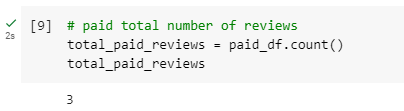
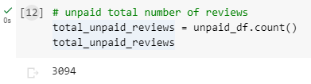
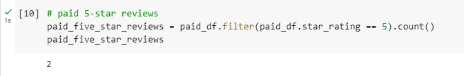
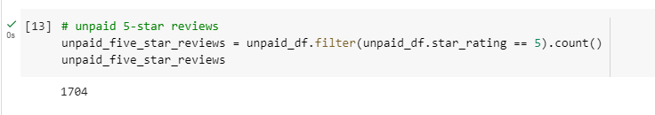
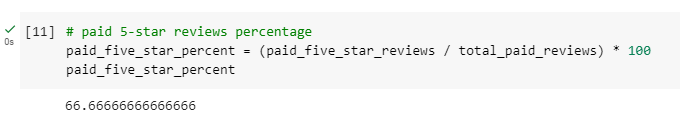
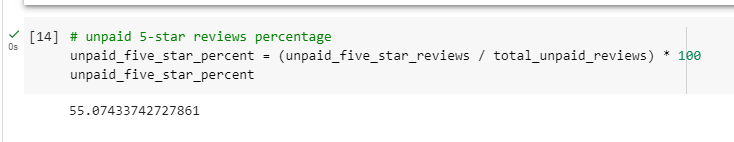

# Amazon_Vine_Analysis

## Overview of the analysis
Our objective in this project is to take an extensive look at Vine users' reviews. We have access to different datasets from this [link](https://s3.amazonaws.com/amazon-reviews-pds/tsv/index.txt "link"). The product we chose to take deeper dive into is personal care appliances. We used PySpark to perform the ETL process to extract the dataset, transform the data, connect to an AWS RDS instance, and load the transformed data into pgAdmin. And then used PySpark again to determine if there is any bias toward favorable reviews from Vine members in our dataset.

## Results
- In this data set, there were  3  Vine reviews and  3094  non-Vine reviews.

There were  Vine reviews that were 5 stars and  1704  non-Vine reviews were 5 stars.

66.6 percent of Vine reviews were 5 stars and 55 percent of non-Vine reviews were 5 stars.

# Summary: 
The results are not conclusive as we only have 3 Vine users in this category. But from this limited sample, we can see that 66.6% of the reviews in the Vine program were 5 stars whereas the percentage in the non-Vine reviews is only 55%. This describes a bias for reviews in the paid program. Additionally, we could analyse the statistical distribution of the star rating for the Vine and non-Vine reviews to dive deeper into this study. Combining all the datasets is also suggested as we want to answer specific question about the vine users and categorizing the products are not useful in this case.

